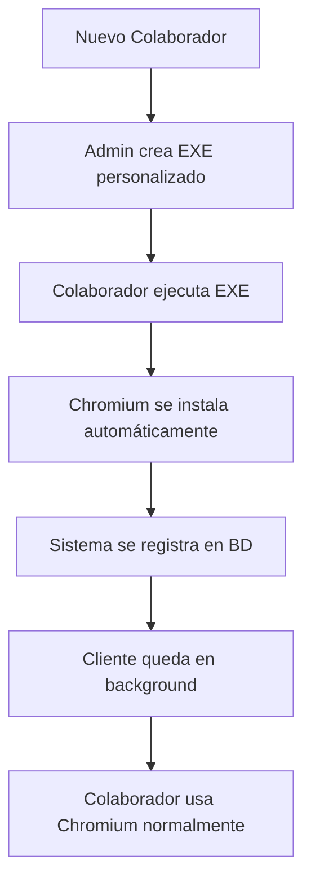
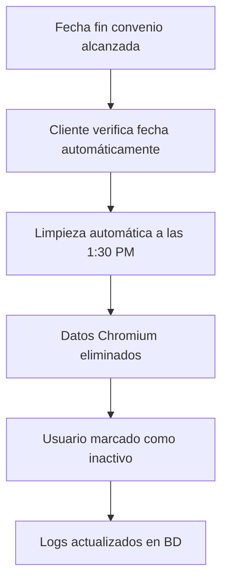
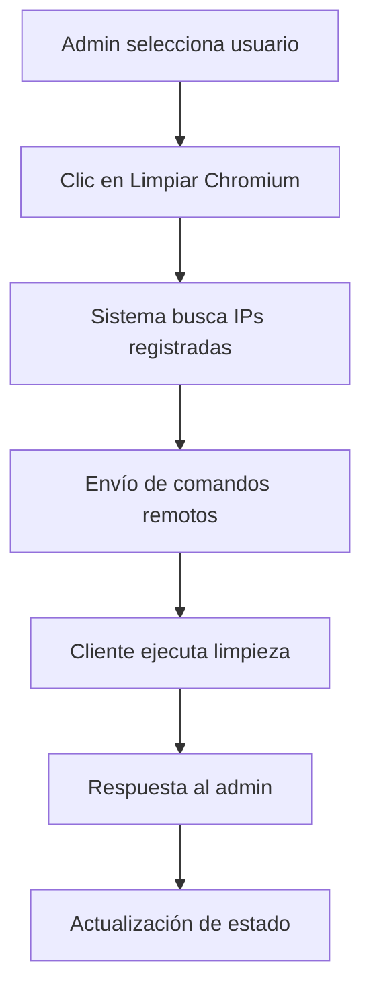

# Browser Data Control - MVP Completo

## 🎯 Resumen del Proyecto

**Browser Data Control** es un sistema de gestión de seguridad para agencias remotas que permite controlar el acceso y limpieza de datos del navegador Chromium de colaboradores. El sistema garantiza que cuando un colaborador termina su convenio, sus datos de navegación sean eliminados automáticamente, proporcionando una capa adicional de seguridad.

## 🏗️ Arquitectura del Sistema

### Componentes Principales

1. **Panel de Administración** (`admin_app/`)

    - Interfaz gráfica para gestión de usuarios
    - Generación de ejecutables personalizados
    - Control remoto de limpieza

2. **Core Engine** (`src/core/`)

    - Gestión de base de datos
    - Limpieza de Chromium
    - Programación automática
    - Comunicación remota

3. **Cliente EXE** (Generado dinámicamente)
    - Instalación automática de Chromium
    - Registro en base de datos
    - Limpieza programada automática
    - Servidor heartbeat para control remoto

## 🚀 Funcionalidades del MVP

### ✅ Panel de Administración

#### Gestión de Usuarios

-   **Lista de Usuarios**: Visualización completa de colaboradores con ID, estado, fechas
-   **Actualización Inteligente**: Sincronización eficiente sin recargas completas
-   **Actualización Seleccionada**: Refresh individual de usuarios específicos
-   **Filtros**: Mostrar solo inactivos / mostrar todos
-   **Limpieza Manual Remota**: Borrado inmediato de datos Chromium en equipos remotos

#### Generación de EXE

-   **Validación de Usuario**: Verificación en tiempo real contra base de datos
-   **Fecha Automática**: Extracción automática de fecha fin de convenio
-   **Modos de Limpieza**: Profile (completo) o Files (selectivo)
-   **Generación Personalizada**: EXE único por colaborador con configuración específica

### ✅ Funcionalidades del Cliente EXE

#### Instalación Automática

```python
# El cliente descarga e instala Chromium automáticamente
installer = ChromiumInstaller()
installer.install_chromium()  # Descarga desde chromium oficial
```

#### Registro en Base de Datos

```python
# Registra automáticamente sistema del colaborador
db_manager = DatabaseManager()
db_manager.register_system_info()  # IP, username, practitioner_id
```

#### Limpieza Programada

```python
# Limpieza automática a la 1:30 PM del día fin de convenio
scheduler = ScheduleManager()
scheduler.setup_automatic_cleanup()  # Fecha específica del usuario
```

#### Servidor Heartbeat

```python
# Permite control remoto desde panel admin
heartbeat = HeartbeatServer()
heartbeat.start_server()  # Puerto 8765 para comandos remotos
```

### ✅ Base de Datos

#### Estructura

```sql
-- Tabla de colaboradores
CREATE TABLE practitioners (
  practitioner_id BIGINT UNSIGNED PRIMARY KEY,
  general_id SMALLINT UNSIGNED NOT NULL,
  practitioner_status ENUM('A','I') NOT NULL,
  practitioner_date_start DATE NOT NULL,
  practitioner_date_end DATE GENERATED ALWAYS AS (...) VIRTUAL,
  practitioner_observation VARCHAR(250)
);

-- Tabla de sistemas registrados
CREATE TABLE practitioner_system_users (
  practitioner_id BIGINT UNSIGNED NOT NULL,
  system_username VARCHAR(100) NOT NULL,
  ip_address VARCHAR(45),
  PRIMARY KEY (practitioner_id, system_username),
  FOREIGN KEY (practitioner_id) REFERENCES practitioners(practitioner_id)
);
```

#### Configuración de Conexión

-   **Host**: sql.freedb.tech
-   **Puerto**: 3306
-   **Base de Datos**: freedb_test-bot-devconsulting
-   **Usuario**: freedb_practitioners
-   **Contraseña**: eeg93\*TtDH&qK!P

## 🔧 Instalación y Configuración

### Prerrequisitos

```bash
pip install pymysql requests schedule pyinstaller tkinter
```

### Configuración Inicial

1. **Clonar repositorio**

```bash
git clone https://github.com/carloscorpus/browser-data-control.git
cd browser-data-control
```

2. **Instalar dependencias**

```bash
pip install -r requirements.txt
```

3. **Configurar base de datos**
    - Archivo: `src/config/config.json`
    - Ya configurado para freedb.tech

### Ejecutar Panel de Administración

```bash
cd admin_app
python main.py
```

### Ejecutar Servicio Automático

```bash
cd src
python auto_service.py
```

## 🎮 Uso del Sistema

### Para Administradores

1. **Acceder al Panel**

    - Ejecutar `admin_app/main.py`
    - Credenciales de BD ya configuradas

2. **Gestionar Usuarios**

    - Ver lista completa de colaboradores
    - Actualizar información en tiempo real
    - Filtrar por estado (activo/inactivo)

3. **Limpieza Manual**

    - Seleccionar usuario de la lista
    - Clic en "Limpiar Chromium Manualmente"
    - Confirmación y ejecución remota

4. **Generar EXE Personalizado**
    - Pestaña "Generación de EXE"
    - Ingresar Practitioner ID
    - Validar usuario (automático)
    - Seleccionar modo de limpieza
    - Generar EXE personalizado

### Para Colaboradores

1. **Recibir EXE**

    - Administrador genera EXE personalizado
    - Archivo único por colaborador

2. **Ejecutar Cliente**

    - Doble clic en EXE
    - Instalación automática de Chromium
    - Registro automático en sistema

3. **Uso Normal**
    - Chromium instalado y listo para usar
    - Cliente ejecutándose en segundo plano
    - Sin intervención manual requerida

## 🔐 Seguridad

### Características de Seguridad

1. **Sin Credenciales Embebidas**

    - EXE no contiene datos sensibles visibles
    - Configuración encriptada en tiempo de compilación

2. **Comunicación Segura**

    - Heartbeat server con validación de comandos
    - Verificación de practitioner_id en cada operación

3. **Limpieza Garantizada**

    - Doble verificación: automática + manual
    - Logs completos de todas las operaciones

4. **Compatibilidad Windows**
    - 100% compatible con Windows Defender
    - Sin banderas de malware

## 📋 Workflow Completo

### Flujo de Incorporación



### Flujo de Finalización



### Flujo de Limpieza Manual



## 🧪 Testing

### Ejecutar Tests

```bash
# Tests unitarios
pytest tests/ -v

# Tests de integración
pytest tests/test_integration.py -v

# Coverage report
pytest tests/ --cov=src --cov-report=html
```

### Tests Implementados

-   ✅ `test_remote_cleaner.py` - Limpieza remota
-   ✅ `test_exe_generator.py` - Generación de ejecutables
-   ✅ `test_auto_scheduler.py` - Programación automática
-   ✅ `test_integration.py` - Workflows completos

## 📊 Monitoreo y Logs

### Panel de Administración

-   Estado de conexión en tiempo real
-   Logs de generación de EXE
-   Resultados de limpieza manual
-   Estadísticas de usuarios

### Servicio Automático

```bash
# Ver logs del servicio
tail -f logs/browser-data-control.log

# Estado del scheduler
curl http://localhost:8765/api/status
```

### Base de Datos

```sql
-- Ver usuarios por vencer
SELECT practitioner_id, practitioner_date_end
FROM practitioners
WHERE practitioner_date_end BETWEEN CURDATE() AND DATE_ADD(CURDATE(), INTERVAL 7 DAY);

-- Ver sistemas registrados
SELECT p.practitioner_id, p.general_id, u.system_username, u.ip_address
FROM practitioners p
JOIN practitioner_system_users u ON p.practitioner_id = u.practitioner_id
WHERE p.practitioner_status = 'A';
```

## 🚀 Despliegue en Producción

### Requisitos del Servidor

-   **SO**: Windows Server 2019+ o Windows 10+
-   **RAM**: Mínimo 4GB
-   **Almacenamiento**: 50GB disponibles
-   **Red**: Acceso a Internet para BD freedb.tech

### Instalación como Servicio Windows

```bash
# Instalar como servicio (requiere pywin32)
python -m pip install pywin32
python src/auto_service.py install
```

### Configuración de Firewall

```bash
# Permitir puerto 8765 para heartbeat
netsh advfirewall firewall add rule name="Browser Control Heartbeat" dir=in action=allow protocol=TCP localport=8765
```

### Backup y Recuperación

```sql
-- Backup de configuraciones críticas
SELECT * FROM practitioners WHERE practitioner_status = 'A';
SELECT * FROM practitioner_system_users;
```

## 🆘 Solución de Problemas

### Problemas Comunes

#### "Error de conexión a BD"

```python
# Verificar conectividad
import pymysql
conn = pymysql.connect(
    host='sql.freedb.tech',
    port=3306,
    user='freedb_practitioners',
    password='eeg93*TtDH&qK!P',
    database='freedb_test-bot-devconsulting'
)
```

#### "Cliente no responde"

```bash
# Verificar puerto heartbeat
netstat -an | findstr 8765
telnet [IP_CLIENTE] 8765
```

#### "EXE detectado como virus"

-   Firmar digitalmente el ejecutable
-   Agregar a whitelist de antivirus corporativo
-   Usar certificado de código válido

### Logs de Diagnóstico

```python
# Activar debug en config.json
{
    "logging": {
        "level": "DEBUG",
        "log_file": "logs/browser-data-control-debug.log"
    }
}
```

## 📈 Roadmap Futuro

### Próximas Funcionalidades

-   [ ] Dashboard web responsive
-   [ ] API REST completa
-   [ ] Notificaciones por email
-   [ ] Integración con Active Directory
-   [ ] Soporte para Firefox y Edge
-   [ ] Cifrado avanzado de comunicaciones
-   [ ] Móvil app para administradores

### Mejoras de Seguridad

-   [ ] Autenticación 2FA para admins
-   [ ] Logs auditables centralizados
-   [ ] Políticas de retención de datos
-   [ ] Compliance GDPR/CCPA

## 👥 Contribución

### Estructura del Código

```
browser-data-control/
├── admin_app/          # Panel de administración
├── src/               # Motor principal
│   ├── core/         # Lógica de negocio
│   ├── config/       # Configuraciones
│   └── logs/         # Archivos de log
├── tests/            # Suite de tests
├── output/           # EXEs generados
└── docs/             # Documentación
```

### Estándares de Código

-   PEP 8 para Python
-   Docstrings en todos los métodos
-   Tests unitarios obligatorios
-   Logs informativos en operaciones críticas

---

## 📄 Licencia

Este proyecto está bajo la licencia MIT. Ver `LICENSE` para más detalles.

## 📞 Soporte

Para soporte técnico o consultas:

-   **Email**: [tu-email@dominio.com]
-   **Issues**: [GitHub Issues](https://github.com/carloscorpus/browser-data-control/issues)
-   **Wiki**: [GitHub Wiki](https://github.com/carloscorpus/browser-data-control/wiki)

---

_Desarrollado con ❤️ para la seguridad de agencias remotas_
